# What delay?
There isn't much relevant background to give. At ingeniumua.be we run the website for a student organisation.


We deploy simple things. Firstly a file directory for study materials such as example questions and course notes, this receives a little bit of traffic during the year with big spikes during finals. Then secondly, we also offer ticketing services.


Microsoft Azure is our cloud provider of choice, we run an 'Azure Database for PostgreSQL flexible server' on a burstable tier. Connected to it as a backend API server, we run a FastAPI application using async SQLAlchemy with asyncpg as driver. As a footnote, we use SvelteKit as a frontend (but that doesn't really have a role in this article). The aforementioned tech stack is monitored (both backend and frontend) with sentry. As a registered non-profit we enjoy the privileges of having sentry premium on the backend service.


Our tech stack used to be hosted on Google Cloud Platform, but because of a massive discount for non profits (our organisation is a registered non-profit) we made the decision to transition to Azure. This migration was completed over the summer, with a brief pause during the retake period for finals. That marked september as our first 'big test' for the application running on Azure.


## Connection Spike Issues
Our first (and almost surely correlated) issue was a series of sudden connection spikes.


Below, a more recent image of a smaller connection spike. I'll be using images from more recent events in this article as that's quite a bit easier for me than searching back weeks.

<figure>
    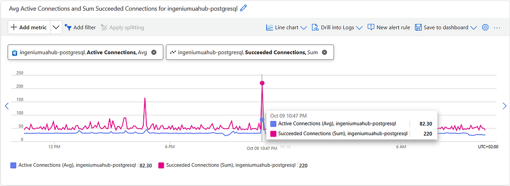
    <figcaption class="text-center text-sm text-gray-500">
        Figure 1: 220 succeeded connections as a spike like that is crazy
    </figcaption>
</figure>

These connection spikes caused our very economically friendly (read=cheap) database to simply panic. Our sentry logs were filled with errors such as the one below. This understandably caused us quite a big headache, as at the start of the semester we usually generate quite a bit of traffic from new students visiting our website for the first time.

<figure>
    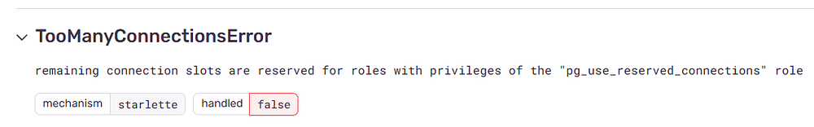
    <figcaption class="text-center text-sm text-gray-500">
        Figure 2: Too many connections error in Sentry.
    </figcaption>
</figure>

Effectively we were capping the connection count on the database server. This was maxed out on our tier at about 40. As you might imagine, this was quite a hassle. Students could not log in, visit the cloud, buy a ticket for a party, etc.


To make sure we wouldn't face extreme problems like this again (which is to say, a continuous stream of internal server errors) we took the easy approach, bumping up the database tier. Does this solve the connection spiking issue? Not at all. Does it remedy the internal server errors? Absolutely!


**The return**


Admittedly, 'return' is not the correct phrasing. We never solved the connection spike issue. Let us call it 'the next symptom'.

<figure>
    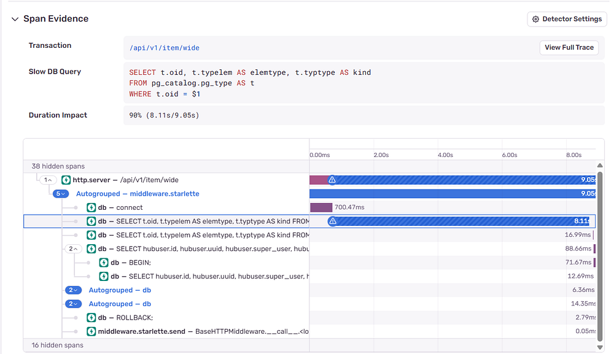
    <figcaption class="text-center text-sm text-gray-500">
        Figure 3: Sentry Error opened.
    </figcaption>
</figure>


In Sentry, "slow db query". Simple http requests taking 9 seconds, just to visualise an item, which is usually a 200–500ms request. That's bad. But, it's relatively rare, only occurring on a handful of requests per day. And with the start of the semester in full swing with events every day, we postpone solving the issue until after we have more free time.


**Spans and traces?**


This article isn't meant as tutorial on distributed tracing. But as a quick reminder, each operation in a system (i.e. backend service) is a span, the collection of all spans recorded in the context of a single request is a trace.


Futher clarifying the two graphs from above, the whole request flow from frontend to backend is 'A'. The HTTP Server ops is the 'B' span which is the full duration of a single request being handled by the backend. 'C'could be a database transaction, 'D' a callout to keycloak, etc. Lastly E is seperate request. This could be another request to the backend being ran simultaniously, or a request to another service.

<figure>
    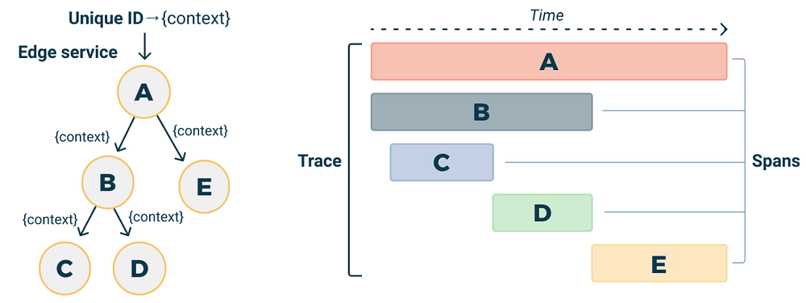
    <figcaption class="text-center text-sm text-gray-500">
        Figure 4: A distributed trace.
    </figcaption>
</figure>


## Why the spike?
After having survived the start of the semester, we start debugging the issue. Our first thought was that sudden jumps in traffic could be the cause. The amount of visitors maybe? A professor referencing our cloud page? As a first step, we take a glance at our traffic. Small sidenote here, to be more privacy-conscious we use umami instead of google analytics.


Below the 9–10 October time period, where the second tall traffic spiked occurred. So ... no, it's not sudden web traffic.

<figure>
    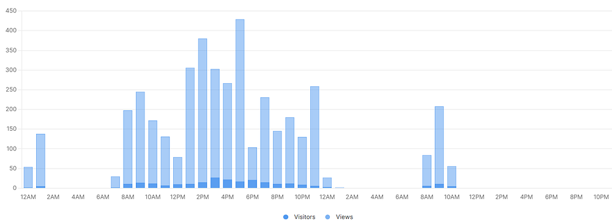
    <figcaption class="text-center text-sm text-gray-500">
        Figure 5: Traffic analysis.
    </figcaption>
</figure>

Maybe it's API requests then? Like previously on the database, we open up the container app hosting the backend API and plot metrics.
Alright! We're moving in the right direction. In the image below we see the anomaly from earlier. A spike in the graph of both response_time and request_count.

<figure>
    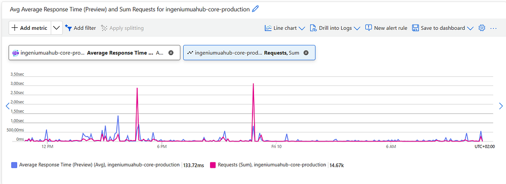
    <figcaption class="text-center text-sm text-gray-500">
        Figure 6: API Requests spike.
    </figcaption>
</figure>


The next step, surely, is finding out what requests these are. Which endpoint is being hit this hard? Digging in sentry gives us a suspicion where to look. We select the 2-day range filtered for this issue and see endpoints related to our cloud. Right, that's where we have to look then?


<figure>
    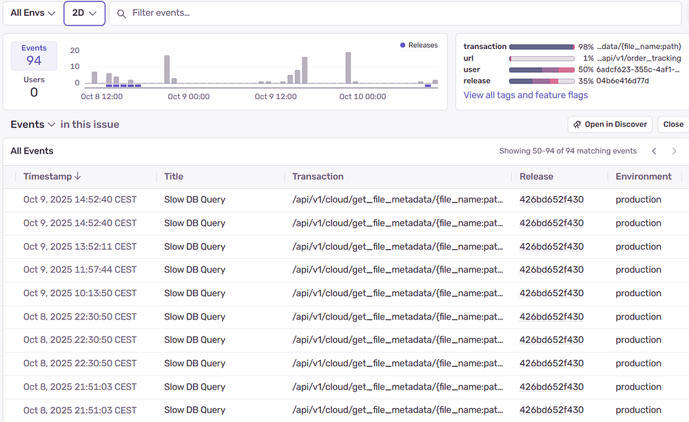
    <figcaption class="text-center text-sm text-gray-500">
        Figure 7: Sentry errors list.
    </figcaption>
</figure>

Supporting our claim from earlier, saying it's not a slow query itself but something with the database connection managing, we can dig through the python code at that endpoint and only see a query for the current user.

```python
@cloud_router.get("/get_file_metadata/{file_name:path}")
async def get_cloud_file_metadata(file_name: str, azure_client: AzureCloudContainerDep):
    cloud_blob = azure_client.get_blob_client(blob=unquote(file_name))
    if not await cloud_blob.exists():
        raise HubException.cloud_file_not_found(filename=file_name)
    return (await cloud_blob.get_blob_properties()).get("metadata")
```

What can we conclude up until now? Not a lot to be honest, something might be going wrong with how the database connections are managed. What's next to investigate then? We listed a couple options for ourselves to get organised:
- Database is running out of connections (again)
- Being a burstable tier, the database is causing a delay
- The connection pool is configured wrong
- It's something with the azure blob

We went through each of the options above in a top to bottom order. Running out of database connections? Well no that shouldn't happen we have more than 400 possible connections. Burstable? Also no, we can plot the credits on the metrics tab as well and we see that we're not even using any of them yet.
Connection pool configured wrong?


Remember, this site is developed by a group of students. No senior engineer anywhere in sight. Often when we're debugging issues like this it end up being a simple configuration error on our end.


In this case we assumed one of use (me) configured the connection pooling wrong and we need to debug it there. We reference the official documentation, validating our code looks correct, with nothing noticibly wrong.

```python
class DatabaseSessionManager:
    def __init__(self, host: str, engine_kwargs: dict[str, Any] | None = None):
        """
        engine is created with asyncpg (as it is the better option compared to psycopg)

        In order to provide the full 2.0 API, a new flag called future will be used,
        which will be seen as the tutorial describes the Engine and Session objects.
        - From sqlalchemy documentation
        """
        self.db_engine = create_async_engine(
          host,
          **engine_kwargs,
          connect_args={
              "timeout": 30,  # Set query timeout (in seconds)
          },
          pool_size=10,  # Maintaining this amount of connections ('ready to use')
          max_overflow=20,  # Go up to this amount when in need of more connections
          pool_recycle=1800,  # Recycle counter to avoid idle disconnect
          # On GCP, the connection would go stale (disconnect) without the server knowing
          # When a request came in, this would cause a 500 "connection is closed" error
          # Not sure if this is still required for the azure deployment, but leaving it just in case
          pool_pre_ping=True,
          # Using the new 2.0 Sqlalchemy api
          future=True,
        )
        self._session_maker = async_sessionmaker(autocommit=False, bind=self.db_engine)
```

Comparing code with documentation isn't actual debugging however, and to quote <a href="https://www.davepacheco.net/blog/about/">Dave Pacheco</a>, we say 'What metrics would we like to know about this issue, which can help us solve it?' And answer ourselves, 'connection pool events'.


With a bit of llm generated assistance, we implement the following code and deploy it without issue. Logging is experimental in sentry by the way, this timing couldn't be any better.

```python
def register_pool_events(engine: AsyncEngine):
  @event.listens_for(engine.sync_engine.pool, "connect")
  def on_connect(dbapi_connection, connection_record):
      sentry_logger.trace("New DB connection created")

  @event.listens_for(engine.sync_engine.pool, "checkout")
  def on_checkout(dbapi_connection, connection_record, connection_proxy):
      sentry_logger.trace("DB connection checked out")

  @event.listens_for(engine.sync_engine.pool, "checkin")
  def on_checkin(dbapi_connection, connection_record):
      sentry_logger.trace("DB connection returned to pool")
```

This code works nicely, we see the logs being tracked correctly per request with their own timestamp and information.


<figure>
    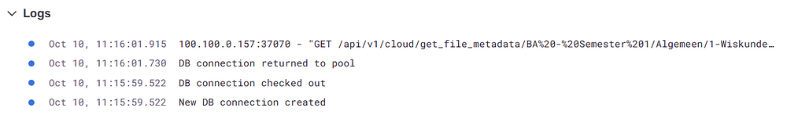
    <figcaption class="text-center text-sm text-gray-500">
        Figure 8: Connection Pool Logs.
    </figcaption>
</figure>


According to the timestamps of these logs however, the connection is being created and returned to pool in about 2 seconds. That tracks with the sentry chart from a bit higher up. We notice the "slow db query" in blue where the triangle exclamation sign, where the connection is created. See below:

<figure>
    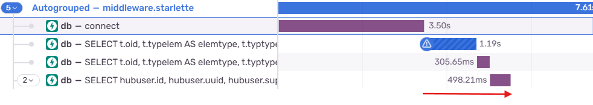
    <figcaption class="text-center text-sm text-gray-500">
        Figure 9: Database operations within trace.
    </figcaption>
</figure>

Surely, there is something going wrong with connection creation then? We haven't nailed down exactly what is causing the issue yet. But, as how these things often go, we can discard other possiblities and narrow down on the issue.


**Cloud Detour**

To finish off the list from earlier, we also take a look at the azure blob which stores the files (essentially Azure's version of s3). Once again we are shown a sharp anomaly, this time with request count to the storage container on the y-axis.

<figure>
    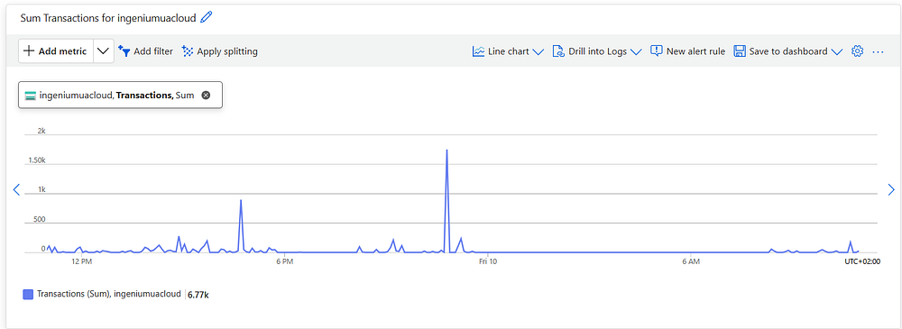
    <figcaption class="text-center text-sm text-gray-500">
        Figure 10: Azure blob request count.
    </figcaption>
</figure>

Going even further we can split on the endpoint being used. The observation we can make from both charts, and the bottom one especially, is that a specific endpoint on our API is being hit very often.

<figure>
    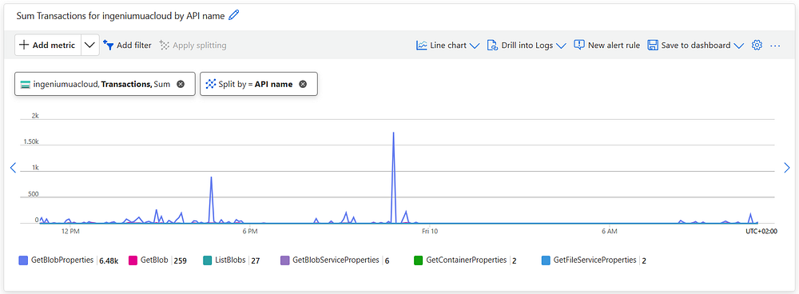
    <figcaption class="text-center text-sm text-gray-500">
        Figure 11: Azure blob requests.
    </figcaption>
</figure>

We propose a failure scenario again. The database session is being started upon the arrival of a HTTP request, the azure blob query is performed and only after having return the response, is the session released. If the blob call takes a long time, that could mean the connection pool is exhausted very quickly if simultaneous requests arrive on the server.


We can discard that speculation immediately after plotting the latency for those operations. Wrong again!


<figure>
    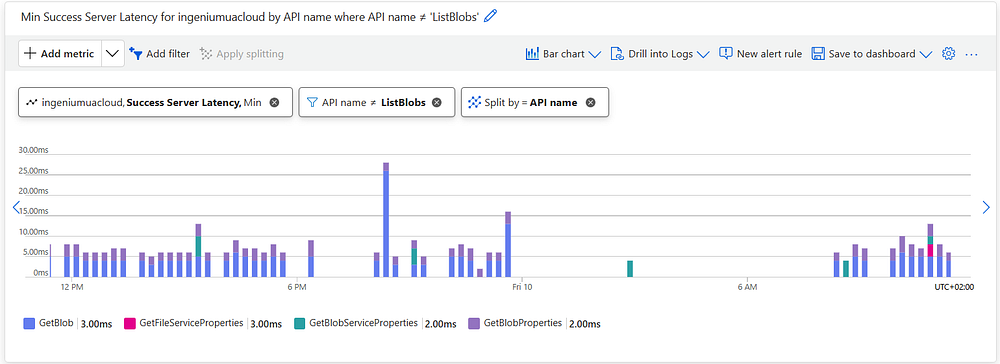
    <figcaption class="text-center text-sm text-gray-500">
        Figure 12: Azure blob latency.
    </figcaption>
</figure>


After examining the sentry trace, we realize this wasn't the right track to search on from the start. The database query is clearly the problem (first red line), not the http request to the blob (second red line).


<figure>
    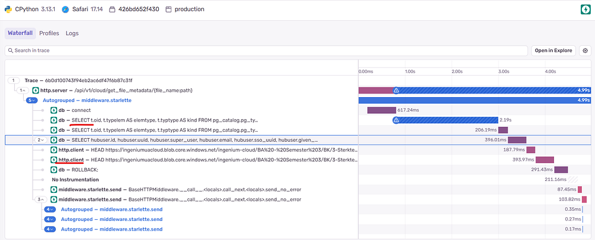
    <figcaption class="text-center text-sm text-gray-500">
        Figure 13: Slow trace.
    </figcaption>
</figure>


## Narrowing down

### Splitting into two issues
You as a reader might say, 'clearly, you have inefficient code on the frontend, rewrite that and it's fine'. You are correct.

However! What if we're ever in a very dense ticket sale, with a couple hundred customers hitting our site to purchase tickets for a large event we're hosting? The issue might return and cause serious defects such as payments not arriving. Being a bit inquisitive (and in any case, we're students, we do what we want, it's not like we get paid to do this) we leave the inefficient code generating the traffic spikes on the frontend and continue debugging this issue live.

<figure>
    
    <figcaption class="text-center text-sm text-gray-500">
        Figure 14: We'll do it live.
    </figcaption>
</figure>

This is where the article splits into two, because, handling the traffic spikes is quite a different beast than investigating why traffic spikes are causing issues for us.

### Issue 1) How can we survive traffic spikes without causing slow queries
**Rate Limiting intermezzo**
We have enabled rate limiting, naturally. Very simple IP based rate limiting, cached in memory and because of that stored per running container instance running.

```python
@cloud_router.get(
    "/get_file_metadata/{file_name:path}",
    dependencies=[Depends(RateLimiter(times=10, seconds=1))],
)
```

Sentry logs all the response http codes for us. We can filter to a specified time range and see what 429 status codes (too-many-requests) were returned per url. Of the 1,5K requests we saw in azure, only 229 are being rate limited.

<figure>
    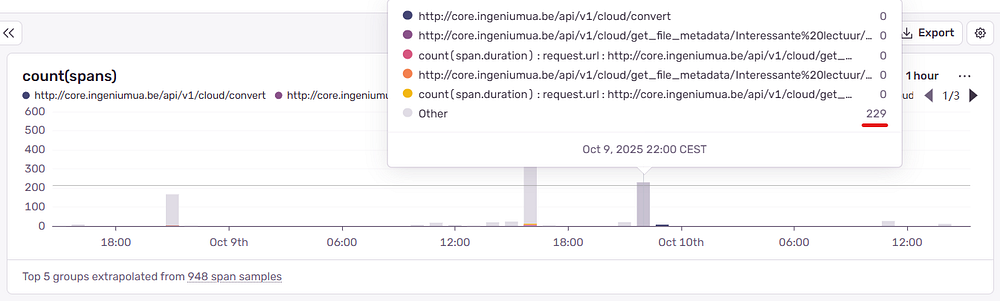
    <figcaption class="text-center text-sm text-gray-500">
        Figure 15: Sentry http code logs.
    </figcaption>
</figure>


Sure we could turn the knob a bit harder on this parameter and return more 429 responses, but that feels like the lazy solution. Decreasing user experience for developer satisfaction in seeing less 'slow db query' errors without solving the underlying problem, that won't do.


**What's happening with the connection pool?**


A stated, we are moving on. Connections pools as they are implemented on in SQLAlchemy are purposely built for handling many shortlived requests by making them use the same connections. In other words, our exact usecase. Why is it still failing then? Using sentry we can visualise the amount of times a database connection was created, checked out of the pool and returned to the pool.


<figure>
    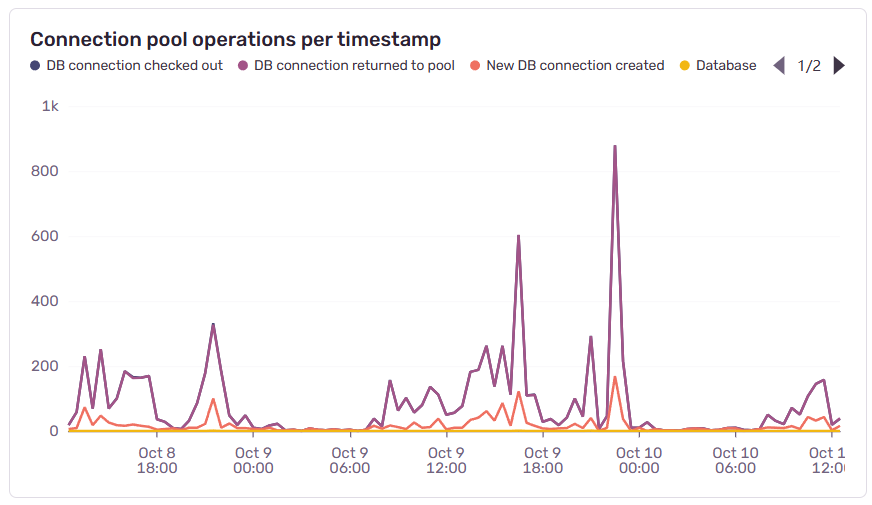
    <figcaption class="text-center text-sm text-gray-500">
        Figure 16: Sentry http code logs.
    </figcaption>
</figure>

Our current hypothesis is that we are hitting slow database queries only on requests where a new database connection is being created. We're making a pretty big statement here in saying that only new database connections are causing slow queries, and that even in huge traffic spikes, already allocated database connections in the connection pool do not suffer any of these drawbacks.


This clearly needs to be verified. We add more code to the connection pool event code, now marking a trace if a database connection was created instead of simply checked out of the pool.

```python
@event.listens_for(engine.sync_engine.pool, "connect")
def on_connect(dbapi_connection, connection_record):
    sentry_logger.trace(
        "New DB connection created", extra={"db.pool_event": "created"}
    )

    # Add a tag to the current transaction/span for filtering in sentry
    scope = get_current_scope()
    if scope and scope.transaction:
        scope.transaction.set_tag("db.connection_created", True)
```

**Inconclusive**
<figure>
    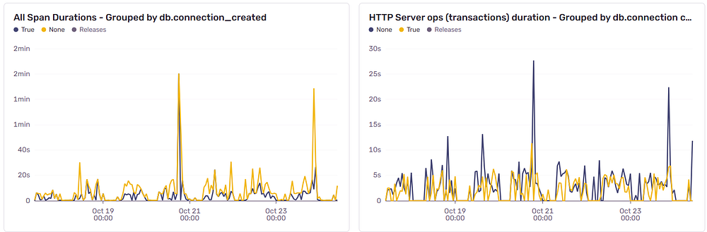
    <figcaption class="text-center text-sm text-gray-500">
        Figure 17: Inconclusive results.
    </figcaption>
</figure>

Above you can see two graphs, both tracking the total duration of a span. On the left we show every single span being recorded on our application. On the y-axis we show how long the span took. The blue and yellow colors designate if we ran the "db connection created" event listener.


The graph on the right displays a similar view, but in this case we only show the spans with type `span.op=http.server`. Practically this is equivalent to plotting each request's duration.


Our hypothesis of "a new database connection will cause the database connection to be slow" is not proven. If that was True, we would have expected to see the yellow line (spans with a 'database connection created' event) to always remain above the blue line. Furthermore, the blue line (requests using the pool) would not reach 3s this often.


**Digging even further**
We already have quite a bit of information assembled and documented at this point, and when asking advice of more experienced software designers, they hint that the connection pooling is not keeping up with database connections being created.


They agree with our hypothesis that connection creation is taking too long, but also agree the graph from earlier does not prove this. We need a more thorough approach in instrumenting the connections then. Below, we show the next version of connection event telemetry code, namely the tagging of spans (read: each database transaction) with a unique identifier. This identifier is user generated, as the <a href="https://docs.python.org/3/library/functions.html#id">id function returns the objects memory address</a>. We couldn't find any identifier exposed by either sqlalchemy or asyncpg. However, the info dict on a connection record can be used to store the identifier so that's usefull.


```python
def register_pool_events(engine: AsyncEngine):
    def get_or_set_connection_id(connection_record) -> str:
        if "conn_id" not in connection_record.info:
            connection_record.info["conn_id"] = id(connection_record)
        return connection_record.info["conn_id"]

    @event.listens_for(engine.sync_engine.pool, "connect")
    def on_connect(dbapi_connection, connection_record):
        conn_id = get_or_set_connection_id(connection_record)
        sentry_logger.trace(
            "New DB connection created",
            extra={"db.pool_event": "created", "db.connection_id": conn_id},
        )
        # Add a tag to the current span for filtering in sentry
        scope = get_current_scope()
        if scope and scope.transaction:
            scope.transaction.set_tag("db.connection_id", conn_id)
            scope.transaction.set_tag("db.connection_created", True)

    @event.listens_for(engine.sync_engine.pool, "checkout")
    def on_checkout(dbapi_connection, connection_record, connection_proxy):
        conn_id = get_or_set_connection_id(connection_record)
        sentry_logger.trace(
            "DB connection checked out",
            extra={"db.pool_event": "checkout", "db.connection_id": conn_id},
        )
        # Adding the connection id to current span
        scope = get_current_scope()
        if scope and scope.transaction:
            scope.transaction.set_tag("db.connection_id", conn_id)

    @event.listens_for(engine.sync_engine.pool, "checkin")
    def on_checkin(dbapi_connection, connection_record):
        conn_id = get_or_set_connection_id(connection_record)
        sentry_logger.trace(
            "DB connection returned to pool",
            extra={
                "db.pool_event": "returned",
                "db.connection_id": conn_id,
            },
        )
        # Adding the connection id to current span
        scope = get_current_scope()
        if scope and scope.transaction:
            scope.transaction.set_tag("db.connection_id", conn_id)
```
That generates the following plot.

<figure>
    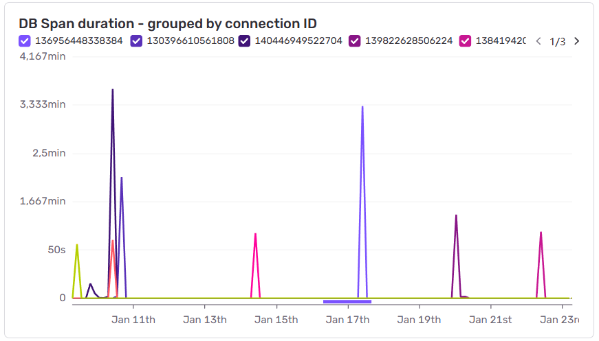
    <figcaption class="text-center text-sm text-gray-500">
        Figure 18: A little less inconslusive results.
    </figcaption>
</figure>

### The plot thickens
As mentioned before the lag spikes were not so frequent as to prevent us from using our applications as we would normally.


However, once, when adding a user to a new group, we experienced a time out and I noticed a 500 error returning. Looking at sentry we noticed a different error than before.

<figure>
    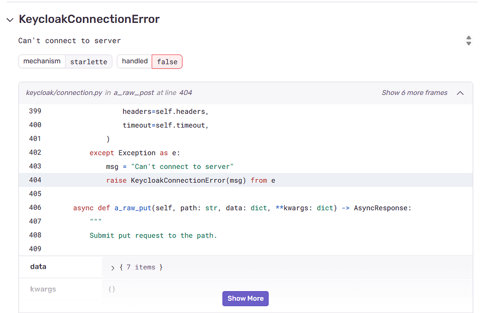
    <figcaption class="text-center text-sm text-gray-500">
        Figure 19: Keycloak error.
    </figcaption>
</figure>

This is quite perculiar. Something we hadn't seen before. So I took a look at the keycloak container's logs.

```yaml
2025-11-03 14:35:28,256 WARN [org.hibernate.engine.jdbc.spi.SqlExceptionHelper] (executor-thread-9) SQL Error: 0, SQLState: null
2025-11-03 14:35:31,131 ERROR [org.hibernate.engine.jdbc.spi.SqlExceptionHelper] (executor-thread-9) Acquisition timeout while waiting for new connection
```

A connection timeout!